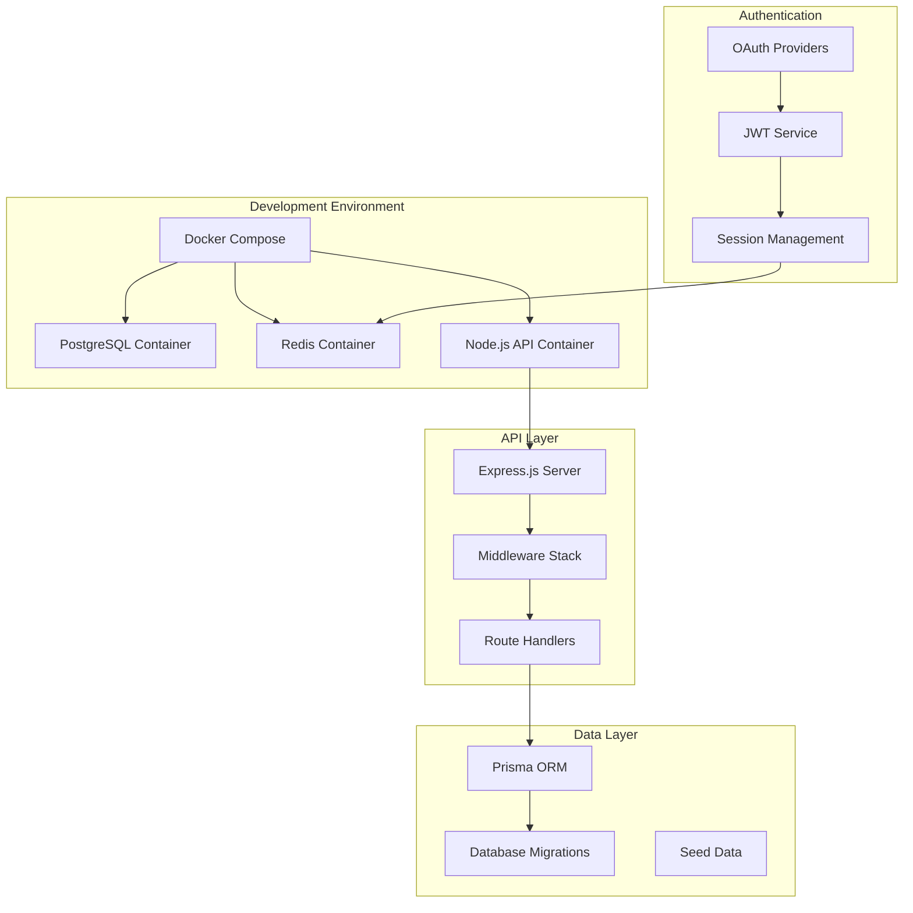
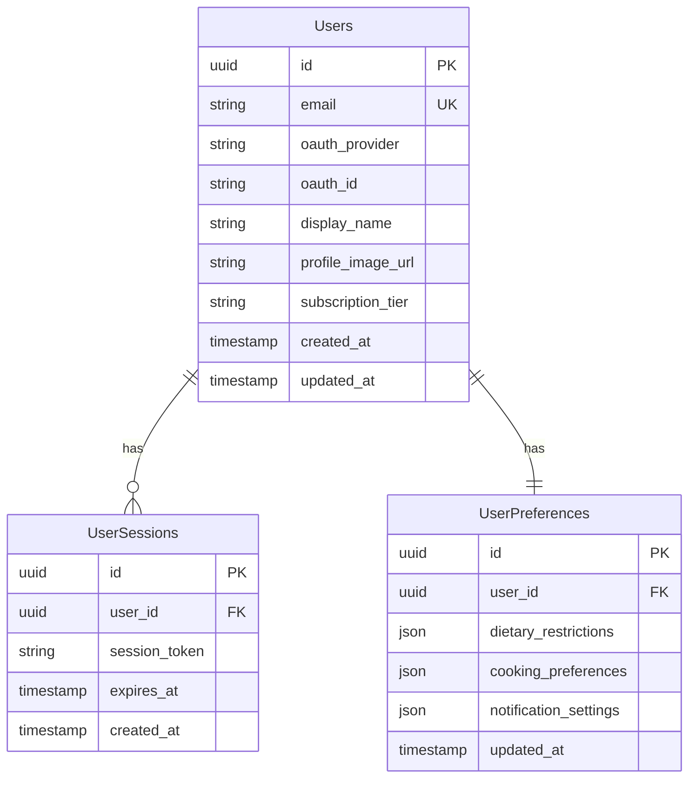
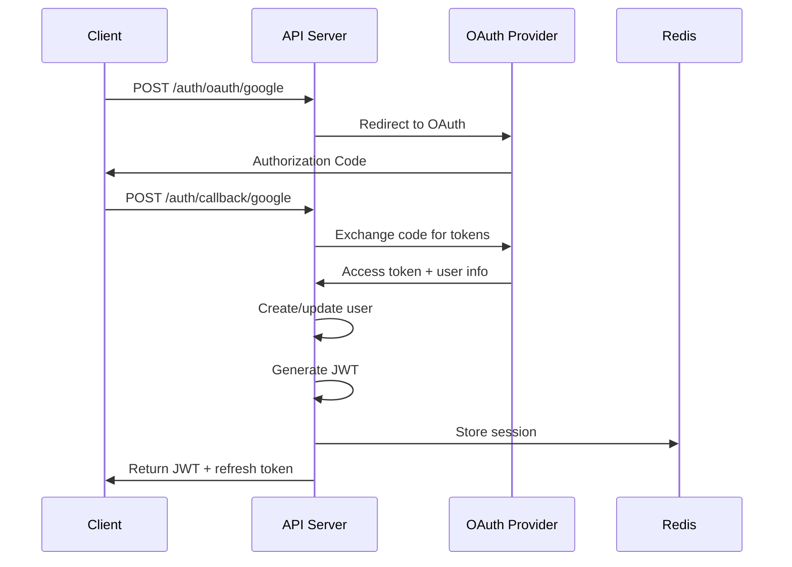
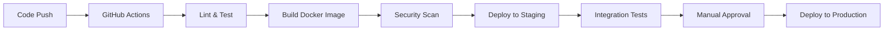

# Foundation - Design

## Overview
The foundation design establishes the core infrastructure and architecture patterns that will support all future feature development. This includes the development environment, database architecture, authentication system, and core API structure.

## Goals
- Create a robust, scalable foundation for the Munchies application
- Establish development patterns and conventions
- Ensure security and performance from the ground up
- Enable efficient feature development going forward

## Architecture

### High-Level System Architecture


### Database Architecture


## Tech Stack & Decisions

### Backend Framework: Express.js + TypeScript
**Decision**: Use Express.js with TypeScript for the API server
**Rationale**: 
- Mature, well-documented framework
- Excellent TypeScript support
- Large ecosystem of middleware
- Team familiarity and rapid development

### Database: PostgreSQL + Prisma
**Decision**: PostgreSQL as primary database with Prisma ORM
**Rationale**:
- ACID compliance for data integrity
- JSON support for flexible schemas
- Excellent TypeScript integration via Prisma
- Strong migration and query optimization tools

### Caching: Redis
**Decision**: Redis for session storage and caching
**Rationale**:
- High-performance in-memory storage
- Built-in session management features
- Pub/sub capabilities for future real-time features
- Excellent Docker support

### Authentication: OAuth 2.0 + JWT
**Decision**: OAuth providers with JWT tokens
**Rationale**:
- Industry standard security practices
- Reduces password management burden
- Better user experience
- Scalable token-based authentication

### Development Environment: Docker Compose
**Decision**: Containerized development environment
**Rationale**:
- Consistent development environment across team
- Easy service management and isolation
- Production parity
- Simplified onboarding process

## Data Models

### User Management Schema
```sql
-- Core user table
CREATE TABLE users (
    id UUID PRIMARY KEY DEFAULT gen_random_uuid(),
    email VARCHAR(255) UNIQUE NOT NULL,
    oauth_provider VARCHAR(50),
    oauth_id VARCHAR(255),
    display_name VARCHAR(255),
    profile_image_url TEXT,
    subscription_tier VARCHAR(50) DEFAULT 'free',
    created_at TIMESTAMP DEFAULT NOW(),
    updated_at TIMESTAMP DEFAULT NOW(),
    
    CONSTRAINT unique_oauth_user UNIQUE (oauth_provider, oauth_id)
);

-- User sessions for JWT management
CREATE TABLE user_sessions (
    id UUID PRIMARY KEY DEFAULT gen_random_uuid(),
    user_id UUID REFERENCES users(id) ON DELETE CASCADE,
    session_token VARCHAR(255) UNIQUE NOT NULL,
    expires_at TIMESTAMP NOT NULL,
    created_at TIMESTAMP DEFAULT NOW()
);

-- User preferences and settings
CREATE TABLE user_preferences (
    id UUID PRIMARY KEY DEFAULT gen_random_uuid(),
    user_id UUID REFERENCES users(id) ON DELETE CASCADE UNIQUE,
    dietary_restrictions JSONB DEFAULT '[]',
    cooking_preferences JSONB DEFAULT '{}',
    notification_settings JSONB DEFAULT '{}',
    updated_at TIMESTAMP DEFAULT NOW()
);
```

### Indexing Strategy
```sql
-- Performance indexes
CREATE INDEX idx_users_email ON users(email);
CREATE INDEX idx_users_oauth ON users(oauth_provider, oauth_id);
CREATE INDEX idx_sessions_token ON user_sessions(session_token);
CREATE INDEX idx_sessions_user_id ON user_sessions(user_id);
CREATE INDEX idx_sessions_expires ON user_sessions(expires_at);
```

## APIs

### Authentication Endpoints
```typescript
// OAuth initiation
POST /api/auth/oauth/google
POST /api/auth/oauth/apple

// OAuth callback handling
GET /api/auth/callback/google
GET /api/auth/callback/apple

// Token management
POST /api/auth/refresh
POST /api/auth/logout
GET /api/auth/me
```

### User Management Endpoints
```typescript
// User profile
GET /api/users/profile
PUT /api/users/profile
DELETE /api/users/account

// User preferences
GET /api/users/preferences
PUT /api/users/preferences
```

### System Endpoints
```typescript
// Health and monitoring
GET /api/health
GET /api/health/db
GET /api/health/redis
```

### API Response Format
```typescript
interface ApiResponse<T> {
  success: boolean;
  data?: T;
  error?: {
    message: string;
    code?: string;
    details?: Record<string, any>;
  };
  metadata?: {
    timestamp: string;
    requestId: string;
    pagination?: PaginationInfo;
  };
}
```

## Security Design

### Authentication Flow


### Security Middleware Stack
```typescript
// Middleware order and configuration
app.use(helmet()); // Security headers
app.use(cors(corsConfig)); // CORS configuration
app.use(rateLimit(rateLimitConfig)); // Rate limiting
app.use(express.json({ limit: '10mb' })); // Body parsing
app.use(compression()); // Response compression
app.use(morgan('combined')); // Request logging
app.use('/api', authMiddleware); // Authentication
app.use(errorHandler); // Error handling
```

## Performance Considerations

### Database Optimization
- Connection pooling with configurable pool size
- Query optimization with proper indexing
- Read replicas for scaling (future consideration)
- Connection timeout and retry logic

### Caching Strategy
- Redis for session storage (TTL-based expiration)
- API response caching for static data
- Database query result caching
- CDN integration for static assets (future)

### Monitoring and Observability
- Request/response logging with correlation IDs
- Performance metrics collection
- Error tracking and alerting
- Database query performance monitoring

## Development Workflow

### Environment Configuration
```yaml
# docker-compose.yml structure
version: '3.8'
services:
  api:
    build: ./packages/backend
    ports: ["3001:3001"]
    environment:
      - NODE_ENV=development
      - DATABASE_URL=postgresql://...
      - REDIS_URL=redis://...
    depends_on: [db, redis]
    
  db:
    image: postgres:14-alpine
    environment:
      - POSTGRES_DB=munchies_dev
      - POSTGRES_USER=dev
      - POSTGRES_PASSWORD=dev_password
    volumes:
      - postgres_data:/var/lib/postgresql/data
    
  redis:
    image: redis:6-alpine
    command: redis-server --appendonly yes
    volumes:
      - redis_data:/data
```

### Development Scripts
```json
{
  "scripts": {
    "dev": "docker-compose up -d && npm run dev:api",
    "dev:api": "nodemon src/index.ts",
    "db:migrate": "prisma migrate dev",
    "db:seed": "prisma db seed",
    "db:reset": "prisma migrate reset",
    "test": "jest",
    "test:watch": "jest --watch",
    "build": "tsc",
    "lint": "eslint src/",
    "docker:up": "docker-compose up -d",
    "docker:down": "docker-compose down"
  }
}
```

## Testing Strategy

### Test Structure
```
packages/backend/src/
├── __tests__/
│   ├── unit/
│   │   ├── services/
│   │   ├── utils/
│   │   └── middleware/
│   ├── integration/
│   │   ├── auth/
│   │   ├── users/
│   │   └── health/
│   └── fixtures/
│       ├── users.ts
│       └── sessions.ts
```

### Test Configuration
```typescript
// Jest configuration for different test types
module.exports = {
  preset: 'ts-jest',
  testEnvironment: 'node',
  setupFilesAfterEnv: ['<rootDir>/src/__tests__/setup.ts'],
  testMatch: [
    '**/__tests__/**/*.test.ts',
    '**/?(*.)+(spec|test).ts'
  ],
  collectCoverageFrom: [
    'src/**/*.ts',
    '!src/**/*.d.ts',
    '!src/__tests__/**/*'
  ],
  coverageThreshold: {
    global: {
      branches: 80,
      functions: 80,
      lines: 80,
      statements: 80
    }
  }
};
```

## Deployment Pipeline

### CI/CD Workflow


### Environment Management
- Development: Local Docker containers
- Staging: Cloud-hosted preview environment
- Production: Scalable cloud deployment
- Feature branches: Ephemeral preview environments

## Non-Functional Requirements

### Performance Targets
- API response time: <200ms for 95% of requests
- Database connection pool: 10-50 connections
- Memory usage: <512MB for API container
- CPU usage: <70% under normal load

### Security Requirements
- All communication over HTTPS
- JWT token expiration: 15 minutes (access), 7 days (refresh)
- Rate limiting: 100 requests/minute per IP
- Input validation on all endpoints
- SQL injection prevention via ORM

### Reliability Targets
- Uptime: 99.9% availability goal
- Error rate: <1% of requests
- Recovery time: <5 minutes for service restart
- Data backup: Daily automated backups

## Risk Mitigation

### Technical Risks
- **Database migration failures**: Backup before migrations, rollback procedures
- **OAuth provider issues**: Fallback authentication methods, monitoring
- **Container networking**: Service discovery, health checks
- **Security vulnerabilities**: Regular dependency updates, security scanning

### Operational Risks
- **Development environment inconsistency**: Documented setup, automation
- **Deployment failures**: Staged rollouts, automated testing
- **Data loss**: Regular backups, point-in-time recovery
- **Performance degradation**: Monitoring, alerting, scaling procedures
