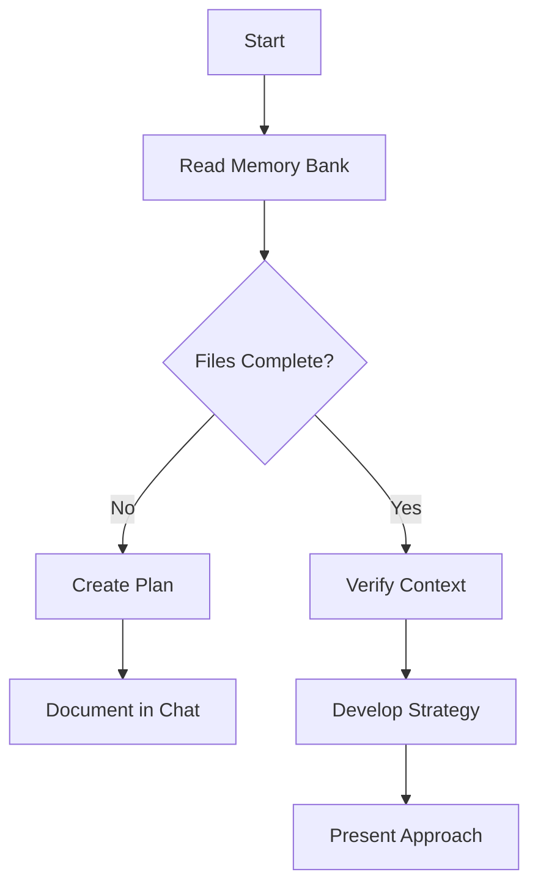
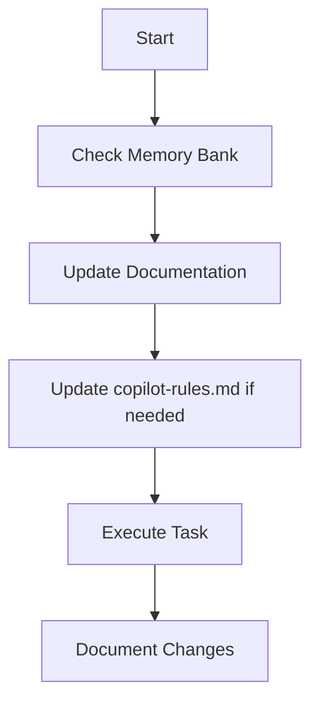
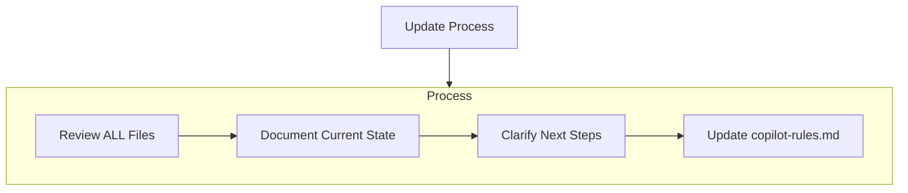

# Memory Bank Instructions - Munchies

## Overview## Usage Instructions

### For Every Development Session
1. **Read this file first** (`memory-bank-instructions.md`)
2. **Load all global context files** in this order:
   - `projectbrief.md` - Understand project vision
   - `productContext.md` - Understand product features
   - `systemPatterns.md` - Understand architecture patterns
   - `techContext.md` - Understand technology choices
   - `activeContext.md` - Understand current focus
   - `progress.md` - Understand current progress
   - `copilot-rules.md` - Understand development rules

3. **Load feature-specific files** if working on a specific feature:
   - Check if `.github/copilot/memory-bank/<feature>/` exists
   - Load all files in that directory

### Slash Commands
The Kiro-Lite workflow uses specific slash commands:

#### `/start feature <name>`
- Creates new feature folder with template files
- Initializes PRD intake process
- Example: `/start feature authentication`

#### `/approve prd`
- Moves from PRD phase to Design phase
- Only use after PRD is complete and reviewed

#### `/approve design`
- Moves from Design phase to Task Breakdown phase
- Only use after design is complete and reviewed

#### `/approve tasks`
- Moves from Task Breakdown to Code Generation phase
- Only use after tasks are complete and reviewed

#### `/implement <TASK_ID>`
- Implements specific task from tasks.md
- Shows file plan, diffs, and tests
- Example: `/implement AUTH-001`

#### `/review complete`
- Confirms implementation is done
- Waits for next command

#### `/update memory bank`
- Refreshes core memory files
- Updates activeContext.md and progress.md

## Workflow Phases

### Phase 0: PRD Intake
- Clarify scope and requirements with user
- Create structured PRD in feature folder
- Wait for `/approve prd` before proceeding

### Phase 1: Design Documentation
- Create technical design document
- Include architecture diagrams
- Define APIs and data models
- Wait for `/approve design` before proceeding

### Phase 2: Task Breakdown
- Break design into implementable tasks
- Assign unique IDs and effort estimates
- Define acceptance criteria
- Wait for `/approve tasks` before proceeding

### Phase 3: Code Generation
- Implement one task at a time
- Show all changes as diffs
- Include tests for new functionality
- Wait for `/review complete` after each task

## File Maintenance

### When to Update
- **activeContext.md**: Daily or after major changes
- **progress.md**: Weekly or after milestone completion
- **projectbrief.md**: Rarely, only for major pivots
- **productContext.md**: When features change significantly
- **systemPatterns.md**: When architectural patterns evolve
- **techContext.md**: When technology choices change
- **copilot-rules.md**: When development standards change

### Update Triggers
- Completing major milestones
- Changing development focus
- Adding new features
- Architectural decisions
- Technology changes
- Process improvements

## Best Practices

### Memory Bank Usage
- Always read instructions first
- Load files in the specified order
- Update files when context changes
- Keep information current and relevant
- Remove outdated information

### Development Workflow
- Follow Kiro-Lite phases strictly
- Never skip phase approvals
- Implement one task at a time
- Show all changes as diffs
- Include comprehensive tests

### Information Quality
- Keep files concise but complete
- Use clear, structured format
- Include relevant examples
- Link related information
- Maintain consistent terminology

## Template Files

### Feature PRD Template
```markdown
# Feature Name - PRD

## Problem Statement
[What problem does this solve?]

## Success Criteria
[How do we measure success?]

## Requirements
[Detailed functional requirements]

## Non-Requirements
[What is explicitly out of scope?]
```

### Feature Design Template
```markdown
# Feature Name - Design

## Overview
[High-level approach]

## Architecture
[Technical architecture and diagrams]

## APIs
[API specifications]

## Data Models
[Database schema changes]
```

### Feature Tasks Template
```markdown
# Feature Name - Tasks

## Task List
- [ ] TASK-001: Description (Effort: S/M/L)
- [ ] TASK-002: Description (Effort: S/M/L)

## Task Details
### TASK-001: Description
**Acceptance Criteria**: [List criteria]
**Files Affected**: [List files]
**Dependencies**: [List dependencies]
```

## Integration with Development Tools

### VS Code Integration
- Use provided tasks when available
- Follow eslint and prettier configuration
- Utilize workspace-specific settings

### Git Integration
- Memory bank files are version controlled
- Include memory bank updates in relevant PRs
- Tag major milestones for easy reference

**REMEMBER:**
After every memory reset, Copilot begins completely fresh. The Memory Bank is the only link to previous work. Maintain it with precision and clarity—project effectiveness and security depend on its accuracy. memory bank system follows the Kiro-Lite methodology for structured development workflow. It provides persistent context and ensures consistent progress tracking across development sessions.

## Core Principle

**Copilot MUST read ALL memory bank files at the start of EVERY task.**

* No exceptions.
* Use this checklist before any work:

  * [ ] Read `.github/copilot/memory-bank/memory-bank-instructions.md` (this file)
  * [ ] Read `.github/copilot/memory-bank/projectbrief.md`
  * [ ] Read `.github/copilot/memory-bank/productContext.md`
  * [ ] Read `.github/copilot/memory-bank/systemPatterns.md`
  * [ ] Read `.github/copilot/memory-bank/techContext.md`
  * [ ] Read `.github/copilot/memory-bank/activeContext.md`
  * [ ] Read `.github/copilot/memory-bank/progress.md`
  * [ ] Read `.github/copilot/memory-bank/copilot-rules.md`
  * [ ] Read any feature-specific files in `.github/copilot/memory-bank/<feature>/`

## File Structure

### Global Context Files (Always Load)
```
.github/copilot/memory-bank/
├── memory-bank-instructions.md  # This file - read first
├── projectbrief.md              # Project vision and goals
├── productContext.md            # Product features and strategy
├── systemPatterns.md            # Architecture and coding patterns
├── techContext.md               # Technology stack and decisions
├── activeContext.md             # Current development focus
├── progress.md                  # Progress tracking and metrics
└── copilot-rules.md            # Development rules and standards
```

### Feature-Specific Context
```
.github/copilot/memory-bank/<feature>/
├── prd.md                      # Product Requirements Document
├── design.md                   # Technical design document
├── tasks.md                    # Task breakdown and tracking
└── context.md                  # Feature-specific context
```
3. **systemPatterns.md**
   System architecture, key technical decisions, design patterns, component relationships.
4. **techContext.md**
   Technologies used, development setup, technical constraints, dependencies.
5. **activeContext.md**
   Current work focus, recent changes, next steps, active decisions.
6. **progress.md**
   What works, what’s left to build, current status, known issues.
7. **copilot-rules.md**
   Project rules, Copilot guidance, safety/security policies, evolving project patterns.

### Additional Context

Add extra files/folders in `.github/copilot/memory-bank/` for:

* Complex features
* Integration specs
* API docs
* Testing strategies
* Deployment procedures

---

## Core Workflows

### Plan Mode



**Description:**

* Always start by reading all memory bank files.
* If files are missing, create a plan and document it.
* If files are complete, verify context and develop a strategy before acting.

### Act Mode



**Description:**

* Check memory bank before any action.
* Update documentation as you work.
* Update `.github/copilot/copilot-rules.md` if new patterns or rules are discovered.
* Document all changes.

---

## Documentation Updates

Update the Memory Bank when:

1. Discovering new project patterns or rules
2. After significant changes
3. When the user requests with **update memory bank** (review ALL files)
4. When context needs clarification



**Note:**
On **update memory bank**, review every file, even if some don’t require changes.
Focus on `.github/copilot/memory-bank/activeContext.md` and `.github/copilot/memory-bank/progress.md` for current state.

---

## Project Rules (`.github/copilot/copilot-rules.md`)

This file is Copilot’s and the team’s learning journal for the project. It captures:

* Critical implementation paths
* User preferences and workflow
* Project-specific patterns
* Security requirements and known challenges
* Evolution of project decisions
* Tool usage patterns

**Example: Core Security Rule**

```markdown
## 🚨 Security: Never Upload Secrets

- Never copy, move, or commit secret files or values (e.g., `.env`, `secrets.json`, API keys, tokens, passwords) to version control or into example/sample config files.
- Example files like `.env.example` must be built by hand with only safe placeholder values.
- Always verify that no secrets are present before staging, committing, or pushing code.
- If a secret is ever committed, treat as a security incident: remove from history and rotate affected credentials immediately.
- Use secret scanning tools (e.g., GitHub Secret Scanning, TruffleHog, git-secrets) for extra safety.
```

---

## How to Use This Document

* Reference this file at the start of every session.
* Use the checklists and diagrams to guide your workflow.
* Update the Memory Bank and `.github/copilot/copilot-rules.md` as you learn.
* Treat this as a living document—improve it as the project evolves.

---

**REMEMBER:**
After every memory reset, Copilot begins completely fresh. The Memory Bank is the only link to previous work. Maintain it with precision and clarity—project effectiveness and security depend on its accuracy.
