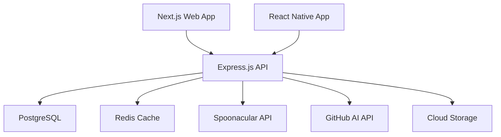
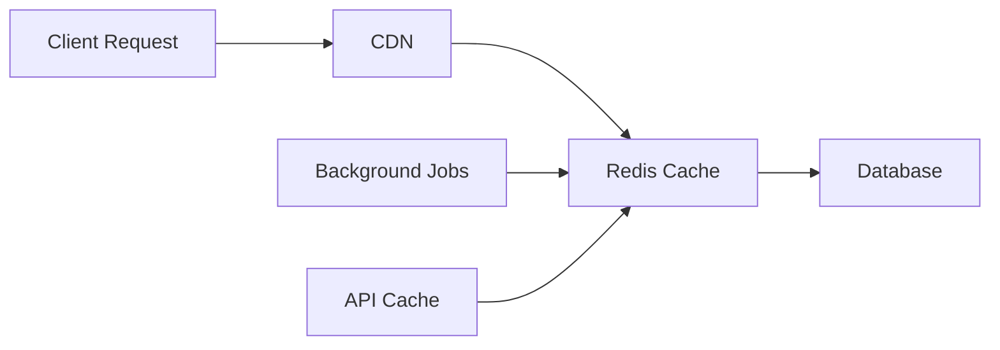

# Tech Context - Munchies

## Technology Stack

### Backend Technology
- **Runtime**: Node.js 18+
- **Framework**: Express.js with TypeScript
- **Database**: PostgreSQL 14+ (primary), Redis (cache)
- **ORM**: Prisma (primary choice for type safety)
- **Authentication**: JWT + OAuth 2.0 (Apple, Google)
- **File Storage**: Cloud storage for images
- **Deployment**: Docker containers

### Frontend Technology
- **Web Framework**: Next.js 14+ with React 18
- **Styling**: Tailwind CSS
- **State Management**: Zustand or React Query
- **Mobile**: React Native (future implementation)
- **TypeScript**: Shared across all platforms

### External Services
- **Recipe Data**: Spoonacular API
- **AI/ML**: GitHub AI APIs
- **Authentication**: Apple Sign-In, Google OAuth
- **Payments**: Stripe
- **Image Processing**: Cloud OCR service
- **Email**: SendGrid or similar
- **Analytics**: PostHog or similar

### Development Tools
- **Package Manager**: npm workspaces
- **Code Quality**: ESLint, Prettier
- **Testing**: Jest, React Testing Library
- **Build**: TypeScript compiler, esbuild
- **Deployment**: Docker, GitHub Actions

## Architecture Decisions

### Backend Architecture


### Database Choice: PostgreSQL
**Rationale**: 
- ACID compliance for financial/user data
- JSON support for flexible recipe data
- Strong TypeScript integration via Prisma
- Mature ecosystem and tooling
- Cost-effective scaling options

### ORM Choice: Prisma
**Rationale**:
- Type-safe database access
- Excellent TypeScript integration
- Database migration management
- Query optimization and caching
- Active development and community

### Frontend Framework: Next.js
**Rationale**:
- SEO optimization for recipe content
- Server-side rendering for performance
- Strong React ecosystem
- Built-in API routes for BFF pattern
- Vercel deployment optimization

### State Management: React Query + Zustand
**Rationale**:
- React Query for server state management
- Zustand for client state (preferences, UI)
- Reduced boilerplate vs Redux
- Excellent caching and synchronization
- TypeScript-first design

### Styling: Tailwind CSS
**Rationale**:
- Rapid prototyping and development
- Consistent design system
- Mobile-first responsive design
- Small bundle size when purged
- Strong community and ecosystem

## Security Considerations

### Authentication Strategy
- OAuth 2.0 with PKCE for mobile security
- JWT with short expiration + refresh tokens
- Role-based access control (RBAC)
- Rate limiting on all API endpoints
- HTTPS everywhere with HSTS headers

### Data Security
- Encrypt sensitive data at rest (AES-256)
- Hash passwords with bcrypt (OAuth backup)
- Sanitize all user inputs
- SQL injection prevention via Prisma
- XSS protection with CSP headers

### API Security
- CORS configuration for web clients
- Input validation with Joi or Zod
- Request size limits
- API versioning for breaking changes
- Audit logging for sensitive operations

## Performance Strategy

### Caching Strategy


### Database Optimization
- Proper indexing strategy
- Query optimization with EXPLAIN
- Connection pooling
- Read replicas for scaling
- Materialized views for complex aggregations

### Image Processing
- Client-side compression before upload
- Progressive JPEG/WebP for web delivery
- Background OCR processing
- CDN distribution for recipe images
- Lazy loading and image optimization

### API Performance
- Response compression (gzip/brotli)
- Pagination for large datasets
- GraphQL consideration for complex queries
- Background job processing for heavy tasks
- Circuit breaker pattern for external APIs

## Scalability Considerations

### Horizontal Scaling
- Stateless API servers for load balancing
- Database connection pooling
- Redis cluster for cache scaling
- CDN for static asset delivery
- Message queue for async processing

### Monitoring and Observability
- Application performance monitoring (APM)
- Database query performance tracking
- Error tracking and alerting
- Business metrics dashboards
- Resource utilization monitoring

### Cost Optimization
- Efficient API usage patterns
- Image optimization and compression
- Database query optimization
- CDN usage for static assets
- Reserved instances for predictable workloads

## Development Workflow

### Code Quality
```json
{
  "husky": "pre-commit hooks",
  "lint-staged": "staged file linting",
  "eslint": "code quality",
  "prettier": "code formatting",
  "jest": "unit testing"
}
```

### Testing Strategy
- Unit tests for business logic (>80% coverage)
- Integration tests for API endpoints
- E2E tests for critical user journeys
- Performance testing for API endpoints
- Security testing for authentication flows

### CI/CD Pipeline
1. Code push to GitHub
2. Automated testing (unit + integration)
3. Code quality checks (ESLint, Prettier)
4. Security scanning
5. Docker image building
6. Deployment to staging
7. E2E testing on staging
8. Production deployment (manual approval)

## Environment Configuration

### Development Environment
- Docker Compose for local services
- Environment variable management
- Hot reloading for rapid development
- Database seeding for consistent data
- Mock external services for offline development

### Production Environment
- Container orchestration (Docker)
- Environment-specific configurations
- Secrets management
- SSL/TLS termination
- Load balancing and health checks

## Migration and Deployment

### Database Migrations
- Prisma migration system
- Version-controlled schema changes
- Rollback capabilities
- Zero-downtime deployment strategies
- Data migration scripts

### Deployment Strategy
- Blue-green deployment for zero downtime
- Feature flags for gradual rollouts
- Database migration automation
- Health check integration
- Rollback procedures
